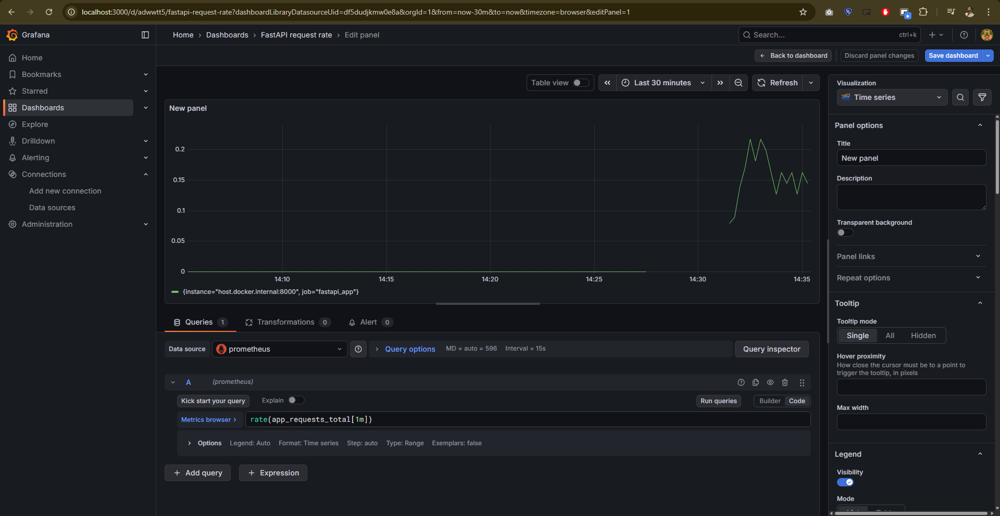
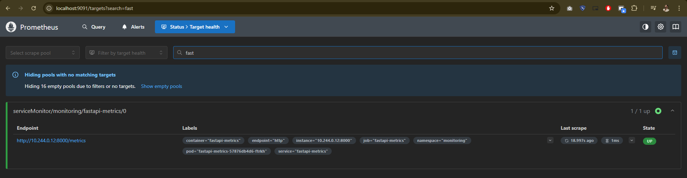
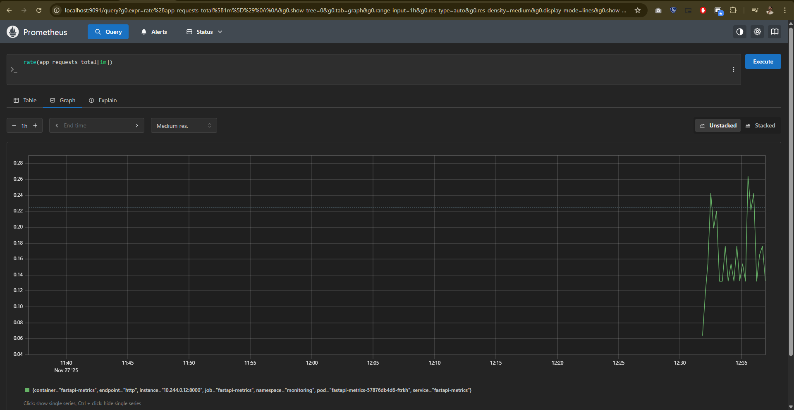

# cern-prometheus-kubernetes-openshift-observability

Hands-on observability lab showing how to monitor **containerised services** with **Prometheus** and **Grafana**, first using **Docker**, then in a **Kubernetes / OpenShift-style** setup.

---

## ✅ Quick checklist – what this repo demonstrates

### Local Docker observability lab

- [x] Run a **Prometheus + Grafana + node_exporter** stack via `docker-compose`
- [x] Scrape:
  - [x] Prometheus itself
  - [x] `node_exporter` (system / container metrics)
  - [x] An instrumented **FastAPI** application exposing `/metrics`
- [x] Configure basic **PromQL** queries in Prometheus and Grafana
- [x] Add at least one **alert rule** in Prometheus (e.g. high request rate)

### FastAPI application metrics

- [x] Implement a **FastAPI** service
- [x] Instrument it with **prometheus-client** (Python)
- [x] Expose application metrics on `GET /metrics`
- [x] Create a custom counter (e.g. `app_requests_total`)
- [x] Visualise app metrics in Grafana (request count, rate, etc.)

### Kubernetes / OpenShift-style monitoring

- [x] Package the FastAPI app as a **container image**
- [x] Deploy it to a **Kubernetes/OpenShift-style cluster**:
  - [x] `Deployment` for the app pods
  - [x] `Service` exposing port `8000` (including `/metrics`)
- [x] Use a **ServiceMonitor** (Prometheus Operator / OpenShift pattern) to:
  - [x] Discover the Service
  - [x] Scrape `/metrics` from the in-cluster app
- [x] Query the in-cluster metrics (`app_requests_total`, `rate(...)`) from:
  - [x] Prometheus UI / OpenShift console
  - [x] Grafana, using Prometheus as a data source

---

## 1. Overview

This repository is a small **observability lab** aimed at demonstrating the monitoring pattern that CERN and other large infrastructures use:

> Containerised services → expose **Prometheus metrics** → scrape via **Prometheus** (and Prometheus Operator / ServiceMonitor) → visualise and alert via **Grafana**.

It is intentionally minimal but complete enough to talk about in an interview or application.

**Core ideas:**

- Prometheus **pull model** (scraping `/metrics`)
- Exporters vs **instrumented app**
- PromQL basics and alerts
- Extending the same pattern from **local Docker** → **Kubernetes / OpenShift**

---

## 2. Architecture

The lab has two layers:

1. **Local Docker-based stack**
   - `docker-compose` runs:
     - `prometheus` – metrics scraping & rule evaluation
     - `node_exporter` – host/container metrics
     - `grafana` – dashboards on top of Prometheus
   - A **FastAPI app** runs on the host, exposing `/metrics` via `prometheus-client`.

2. **Kubernetes / OpenShift-style stack**
   - The same **FastAPI app** built as a container and deployed to a cluster.
   - A `Deployment` and `Service` expose the app and its `/metrics` endpoint.
   - A `ServiceMonitor` resource (via Prometheus Operator / OpenShift) instructs Prometheus to scrape the Service.

---

## 3. Repo structure

```text
.
├── docker-compose.yml          # Prometheus + node_exporter + Grafana stack
├── prometheus.yml              # Scrape configs for local targets
├── alert.rules.yml             # Example Prometheus alert rules
├── app/
│   ├── main.py                 # FastAPI app with /metrics
│   └── requirements.txt
├── grafana/
│   └── dashboard.json          # (Optional) exported Grafana dashboard
└── k8s-openshift/
    ├── deployment.yaml         # FastAPI Deployment
    ├── service.yaml            # ClusterIP Service exposing the app
    └── servicemonitor.yaml     # Prometheus Operator / OpenShift-style monitor
```

## 4. Screenshots

### 4.1 Local Grafana – FastAPI request rate (Docker)

This panel shows the request rate for the FastAPI app in the **local Docker-based Prometheus + Grafana stack**, using:

```promql
rate(app_requests_total[1m])
```


### 4.2 In-cluster Prometheus – ServiceMonitor target

The FastAPI service is discovered via a ServiceMonitor and scraped by the
kube-prometheus-stack Prometheus instance running inside the Kubernetes cluster.



### 4.3 In-cluster Prometheus – FastAPI request rate

The same rate(app_requests_total[1m]) query, but executed against the
in-cluster Prometheus, confirming metrics are scraped from the Kubernetes/“OpenShift-style” setup.

